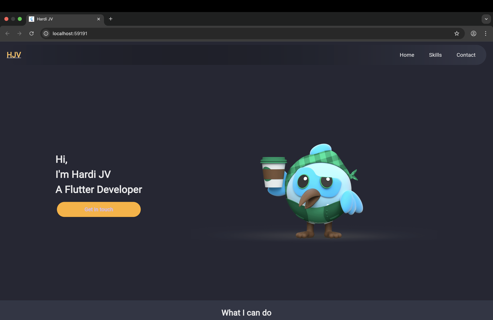
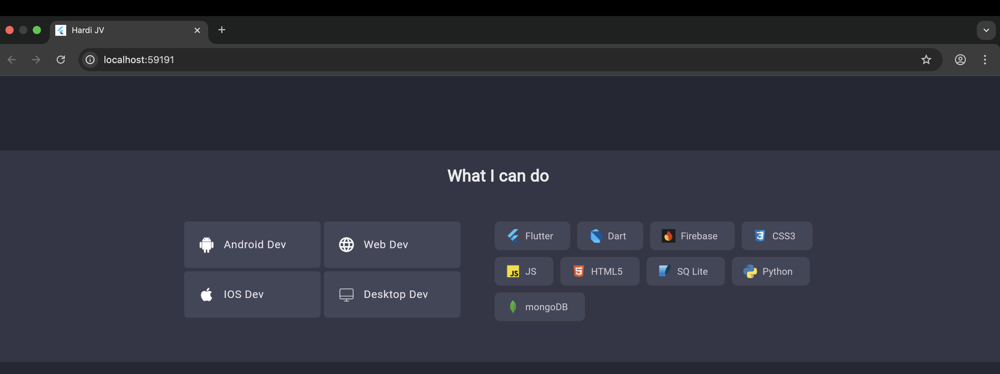
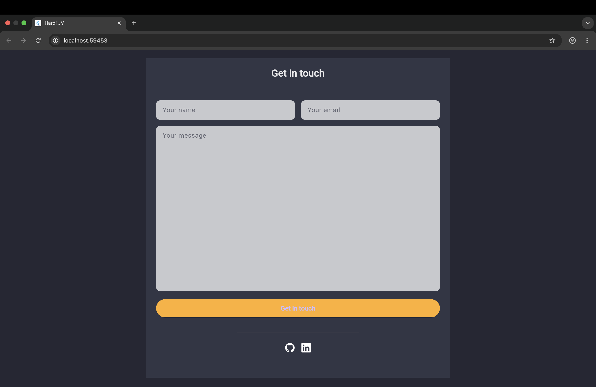

# 💼 Flutter Profile Page with Firebase Contact Integration

Welcome to my Flutter project! 🚀  
This is a simple yet elegant **Profile Page App** designed using **Flutter**, showcasing my skills, projects, and offering an easy way to get in touch via a **Contact Me** form integrated with **Firebase**.

## 📱 Features

- ✅ Beautiful and responsive **Profile Page UI**
- 🎯 Highlights **my technical skills and expertise**
- 📇 Integrated **Contact Me** section powered by **Firebase Firestore**
- 🌐 Clickable **GitHub** and **LinkedIn** icons to view my professional profiles
- 🔒 Secure data storage of messages from visitors
- 📦 Clean, well-structured, and modular codebase

## 🔧 Technologies Used

- **Flutter** – for building the cross-platform app
- **Firebase Firestore** – to store user contact information securely
- **Firebase Core & SDKs** – for backend connectivity
- **Font Awesome / Icons** – to add GitHub and LinkedIn links

  ## 📷 Screenshots

### 🧑‍💼 Profile Page

### 🎯 Skills Page

### 📨 Contact Me Form

## 📬 Contact Me

- [GitHub](https://github.com/hardivaidya004506)
- [LinkedIn](https://www.linkedin.com/in/hardi-jignesh-vaidya-118605340/)

---

> 🌟 Feel free to fork this repo, explore the code, or reach out if you'd like to collaborate on cool projects!

